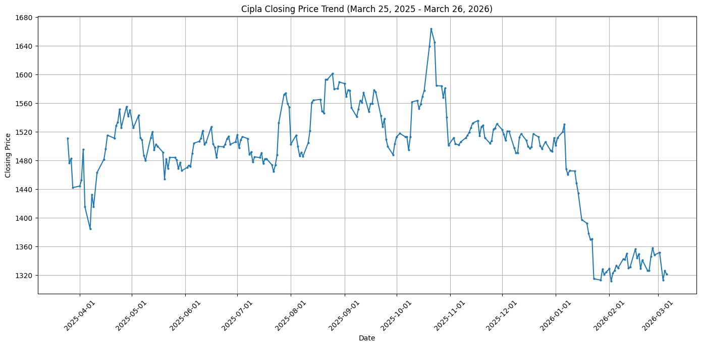
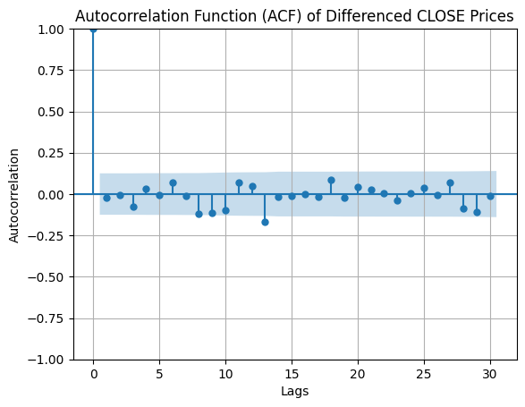
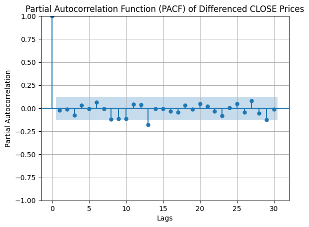
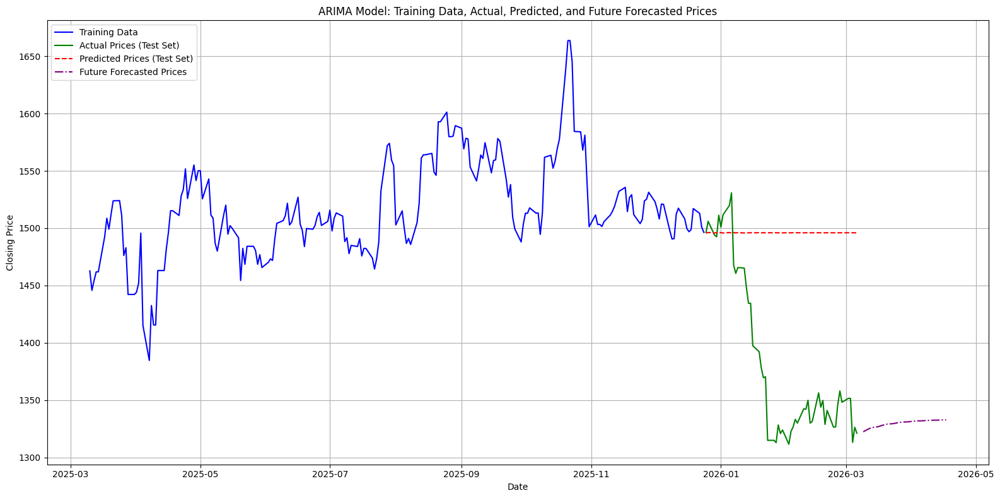

# Time Series Analysis and Forecasting of CIPLA Stock using ARIMA

## Assignment Details

**Course:** Data Analytics and Visualization
**Topic:** Time Series Analysis using ARIMA Model
**Stock Analyzed:** CIPLA (NSE)

This project performs time series analysis on the daily closing prices of CIPLA stock. The goal is to analyze historical price data and forecast the next 30 days of closing prices using the ARIMA model.

---

# 1. Dataset Description

The dataset was downloaded from the **NSE (National Stock Exchange) Historical Data portal**.

The dataset contains the following columns:

| Column       | Description                   |
| ------------ | ----------------------------- |
| DATE         | Trading date                  |
| OPEN         | Opening price                 |
| HIGH         | Highest price of the day      |
| LOW          | Lowest price of the day       |
| PREV CLOSE   | Previous day closing price    |
| LTP          | Last traded price             |
| CLOSE        | Closing price of the day      |
| VWAP         | Volume weighted average price |
| 52W H        | 52 week high                  |
| 52W L        | 52 week low                   |
| VOLUME       | Total shares traded           |
| VALUE        | Total traded value            |
| NO OF TRADES | Number of trades              |

For time series forecasting, the **DATE and CLOSE columns** are primarily used.

---

# 2. Data Preprocessing

Before performing time series analysis, the dataset was cleaned and prepared.

### Steps Performed

1. Loaded the dataset using **Pandas**
2. Removed unnecessary columns
3. Converted the DATE column into **datetime format**
4. Set DATE as the **index of the dataset**
5. Converted CLOSE values to numeric format
6. Checked and handled missing values
7. Sorted data chronologically

### Example Code

```python
df = pd.read_csv("Quote-Equity-CIPLA.csv")

df.columns = df.columns.str.strip()

df = df[['DATE','CLOSE']]

df['DATE'] = pd.to_datetime(df['DATE'])

df.set_index('DATE', inplace=True)

df['CLOSE'] = df['CLOSE'].astype(float)
```

---

# 3. Visualization of Closing Price Trend

A line graph was plotted to visualize how the closing price of CIPLA stock changed over time.

This helps in understanding:

* overall trend
* fluctuations
* potential outliers

### Graph



---

# 4. Stationarity Check using ADF Test

Before applying ARIMA, we need to check if the time series is **stationary**.

A time series is stationary when:

* mean is constant
* variance is constant
* no long-term trend exists

The **Augmented Dickey-Fuller (ADF) Test** is used for this purpose.

### Hypothesis

**Null Hypothesis (H₀):**
The time series is **non-stationary**

**Alternative Hypothesis (H₁):**
The time series is **stationary**

### Example Code

```python
from statsmodels.tsa.stattools import adfuller

result = adfuller(df['CLOSE'])
```

If **p-value > 0.05**, the series is non-stationary.

### ADF Test Output


---

# 5. Differencing to Make Series Stationary

Since stock price data usually contains trends, the series is converted into a stationary series using **differencing**.

Differencing calculates the change between consecutive observations.

### Formula

```
Difference = Current Value - Previous Value
```

### Code

```python
df_diff = df['CLOSE'].diff().dropna()
```

---

# 6. ACF and PACF Plots

ACF (Autocorrelation Function) and PACF (Partial Autocorrelation Function) plots help determine the parameters of the ARIMA model.

These plots are used to estimate:

| Parameter | Meaning              |
| --------- | -------------------- |
| p         | Autoregressive order |
| d         | Differencing order   |
| q         | Moving average order |

### ACF Plot



### PACF Plot



---

# 7. ARIMA Model Implementation

The ARIMA model is used to forecast future stock prices based on historical data.

ARIMA stands for:

| Component | Meaning                   |
| --------- | ------------------------- |
| AR        | Auto Regression           |
| I         | Integrated (Differencing) |
| MA        | Moving Average            |

### Model Format

```
ARIMA(p, d, q)
```

### Code

```python
from statsmodels.tsa.arima.model import ARIMA

model = ARIMA(df['CLOSE'], order=(p,d,q))
model_fit = model.fit()
```

---

# 8. Forecasting Future Prices

The trained ARIMA model is used to forecast the next **30 days of closing prices**.

### Code

```python
forecast = model_fit.forecast(steps=30)
```

---

# 9. Forecast Visualization

The predicted values are plotted along with the historical data to visualize future trends.

### Forecast Graph



---

# 10. Interpretation of Results

Based on the ARIMA model forecast:

* The model predicts the future closing prices for the next 30 trading days.
* The predicted trend shows possible fluctuations based on historical behavior.
* This forecast can help in understanding potential price movement patterns.

However, stock prices are influenced by many external factors such as market conditions, economic policies, and global events, so predictions should be interpreted cautiously.

---

# 11. Tools and Libraries Used

The following Python libraries were used:

* Pandas
* NumPy
* Matplotlib
* Statsmodels

---

# 12. Conclusion

This project demonstrated the application of **time series analysis using the ARIMA model** to analyze stock price data.

Key outcomes include:

* Data preprocessing and visualization
* Stationarity testing using ADF
* Model parameter selection using ACF and PACF
* Forecasting future stock prices

The ARIMA model provides a useful statistical approach for time series forecasting based on historical data patterns.

---

# 13. Repository Structure

```
DAV-Assignment
│
├── DAV-assign-1.ipynb
├── cipla_dataset.csv
├── README.md
│
└── images
    ├── trend_plot.png
    ├── adf_result.png
    ├── acf_plot.png
    ├── pacf_plot.png
    └── forecast_plot.png
```

---

## AI Ethics & Responsible Usage Declaration

I hereby declare that:

* The dataset used in this assignment has been obtained from the **National Stock Exchange (NSE) historical data portal**, which is a publicly available and ethically sourced dataset.
* The dataset does not contain any personal or sensitive information and is strictly limited to publicly available stock market data.
* Potential limitations and biases in stock market data have been considered, including market volatility and external economic factors that may influence price movements.
* Privacy considerations are maintained since no personal or confidential information is involved in this dataset.
* I understand the responsible and ethical use of data analytics and AI techniques in the development of forecasting models.
* This work follows the academic integrity and ethical AI guidelines provided by the institution.

---

### Dataset Details

**Source:** National Stock Exchange (NSE) Historical Data Portal
**Type of Data:** Financial Time Series Data (Stock Market Data)
**Contains Personal/Sensitive Data?** No

**If Yes, describe anonymization steps:** Not applicable, as the dataset contains only publicly available financial market data.

---

### Identified Bias (if any)

The dataset represents historical stock prices which may be influenced by external factors such as market conditions, economic events, company announcements, or investor sentiment. These factors may introduce variability in the data, and therefore forecasts produced by the model may not fully capture sudden market changes.

---

### Responsible Usage Statement

The results obtained from this analysis are intended solely for educational and analytical purposes. The forecasting model developed in this assignment should not be interpreted as financial advice or used for real-world trading decisions.

---

### Student Details

**Student Name:** Aryan Prakash Pilwalkar
**UIN:** 231A016
**Course:** TE Artificial Intelligence & Data Science
**Date:** 15 / 03 / 2026
**Signature:** 
